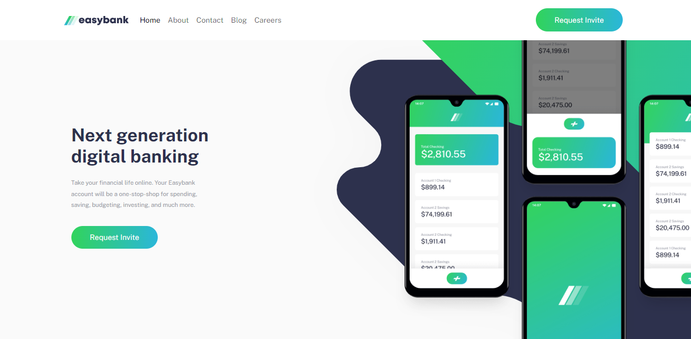
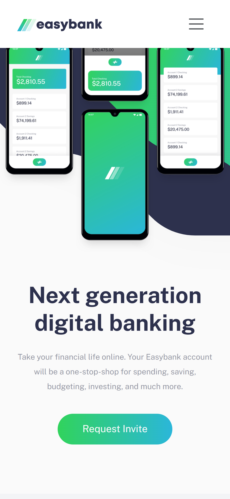

# Frontend Mentor - Easybank landing page solution

This is a solution to the [Easybank landing page challenge on Frontend Mentor](https://www.frontendmentor.io/challenges/easybank-landing-page-WaUhkoDN). Frontend Mentor challenges help you improve your coding skills by building realistic projects. 

## Table of contents

  - [Overview](#overview)
  - [The challenge](#the-challenge)
  - [Screenshot](#screenshot)
  - [Links](#links)
  - [My process](#my-process)
  - [Built with](#built-with)
  - [Author]

## Overview

### The challenge

Users should be able to:

- View the optimal layout for the site depending on their device's screen size
- See hover states for all interactive elements on the page

### Screenshot

### Links

- Live Site URL: [Add live site URL here](https://tjay05.github.io/easy-bank-landingpage/)

### Built with

- Semantic HTML5 markup
- CSS custom properties
- Flexbox
- Mobile-first workflow
- Bootsrap

## Author

- Website - [Add your name here](https://www.your-site.com)
- Frontend Mentor - [@Tjay05](https://www.frontendmentor.io/profile/Tjay05)
- Twitter - [@tjay_yy](https://www.twitter.com/tjay_yy)
